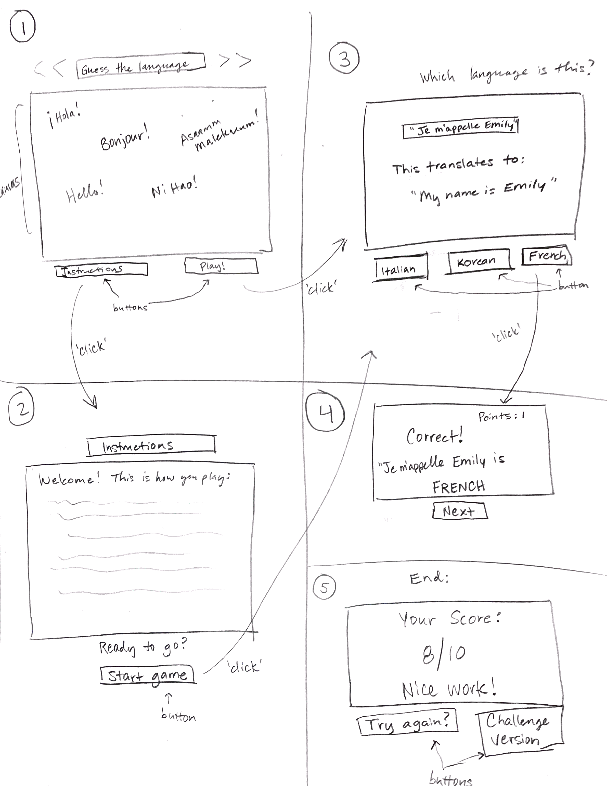
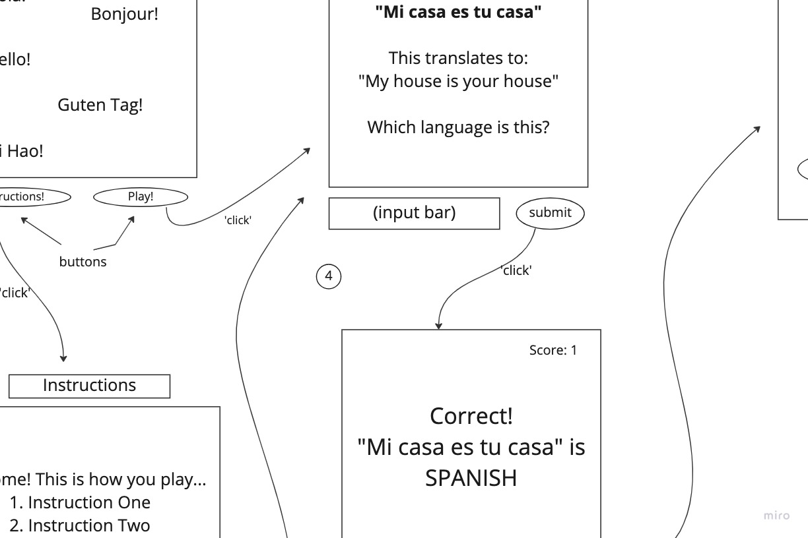

### Language Quiz Extraordinaire

## Elevator pitch:

"There are over 7,000 languages spoken around the globe. Think you could identify some of them? Test your knowledge of different languages using this fun game! You'll be given phrases from random languages and it's up to you to identify them to earn points. Learn as you go with English translations given for each phrase. Play against yourself to beat your high score!"

## About the Game:

This game is the perfect opportunity for the polyglot within you to show off and shine. After reading the instructions, the player will press 'Play" and then be shone one phrase at a time. An English translation as well as audio clip speaking the phrase will be available. A hint is also included for each phrase. The player will need to type in the correct language to earn a point. If the guess is incorrect, no point is given. The game is timed, so a player only has 90 seconds to get through as many levels as possible. There will be 10 phrases total. At the end, the player's final score will be displayed as number correct out of 10. There will be an option to press the restart button to start over again from the beginning.

## Play the Game:
https://emilyjryan.github.io/project-one-language-quiz/

## My Approach:
I first started this game by sketching out a rough wireframe for what I wanted the graphics to look like, including different slides with button clicks. I was originally thinking I might use canvas to render my phrases with each level, but then decided that using DOM with Javascript instead would be more feasible and more conducive to my specific idea. I then created a simple HTML file with all the necessary items to begin the game.

Although I'm sure there are countless ways I could have done this type of game, I ended up adding individual block elements to my HTML doc that I would either display or hide depending on the certain slide/level the player was on. I was able to incorporate audio files into each phrase slide so the user could click the 👂🏼 button and hear the phrase pronounced by a native speaker. And I added a timer function that would count down during the game and display a "Time's Up" slide if it ran down to 0 before the 10 questions were answered.

## Tech stack used:

- HTML
- CSS
- Javascript

## Wireframe:
<!-- local image -->

## MVP Goals:
- Render the starting screen with a main div, instruction button, and start button
- On 'instructions' click, render instruction page with directions in the main div
- on 'play' click, render new screen
- Render 1 phrase at a time to appear on the screen, from a fixed list of 5 phrases, with the English translation below
- Render a free type input bar with a submit button for user to type in a language and submit their guess.
- User types in correct language that matches phrase --> render 'correct' screen and add 1 point, render 'next' button
- User types in incorrect language --> render 'incorrect' screen, render 'next' button
- Game ends after the 5 phrases have been clicked through
- End screen rendered with ending score, and restart button to reset to beginning

## Stretch Goals:
- Add more levels/phrases, perhaps up to 10 or 20.
- Incorporate a timer to see how many points a player can get within a specific timeframe
- Include a @media query for mobile devices and smaller screens
- Add audio clips of each phrase
- Keep track of high scores so player can play against his best score
- Add an option to select difficulty level depending on the phrases given, with easy, medium, and hard

## Potential roadblocks:
- Difficulty linking the language phrase key with the correct button so a correct answer is computed
- Difficulty setting up a timer with an interval that clears if all the levels are complete with time still left on the clock

## Post project reflective:
Overall, this game was a blast to create. Initially I wasn't sure how complex I would be able to make the game within the specific project timeframe, but as soon as I got going and started adding different elements and buttons and click events, the whole project came together rather easily. I did hit a few frustrating bugs, such as a setInterval for my timer that wasn't easily deactivated. But with the help of other classmates and my fabulous instructor team, I was able to work through the bugs and resolve the issues. The biggest nuggest of coding wisdom I learned was to try and understand the problem as fully as you can before you start solving it. For instance, adding in console.logs wherever appropriate to provide a snapshot in to the computer's brain at that moment of time in the code is extremely valuable. When working with issues in CSS, it's vastly helpful to inspect the elements in the browser to see what is and what isn't being translated into the style of the elements. Lastly, the console on the browser was my best friend through the project. Even though the red letters of doom seemed frustrating at a few points, just knowing what the error was helped me understand what I needed to fix, or at least pointed me in the right direction.

I wish I had had time to incorporate a challenge mode, perhaps a mode without hints to make the game harder. I also wanted to use canvas to render each phrase on the screen that would then float down the screen slowly until the user was able to guess the language or until it reached the bottom. Additionally, I never got around to creating a high score that could be stored locally on a user's browser, but I'm hopeful I can incorporate that in the game in the future with a little more time.

## WORKS CITED

# Images:
- https://earthobservatory.nasa.gov/ContentFeature/NightLights/images/media/BlackMarble_2016_Asia_composite.png (2)
- https://media.istockphoto.com/id/928810368/vector/welcome-in-different-languages-wordcloud-vector-on-black-background.jpg?s=612x612&w=0&k=20&c=XeZw5CkpfI2pKCw5FpsqExeYxTuEmxW1H4x5M0vO76E= (2)
- https://i.ytimg.com/vi/sjKeKSOF7SE/maxresdefault.jpg (2)

# Audio Clips:
- Google translate for phrases
- https://pixabay.com/
https://cdn.pixabay.com/download/audio/2022/10/31/audio_59a68c6340.mp3?filename=acoustic-vibe-124586.mp3
